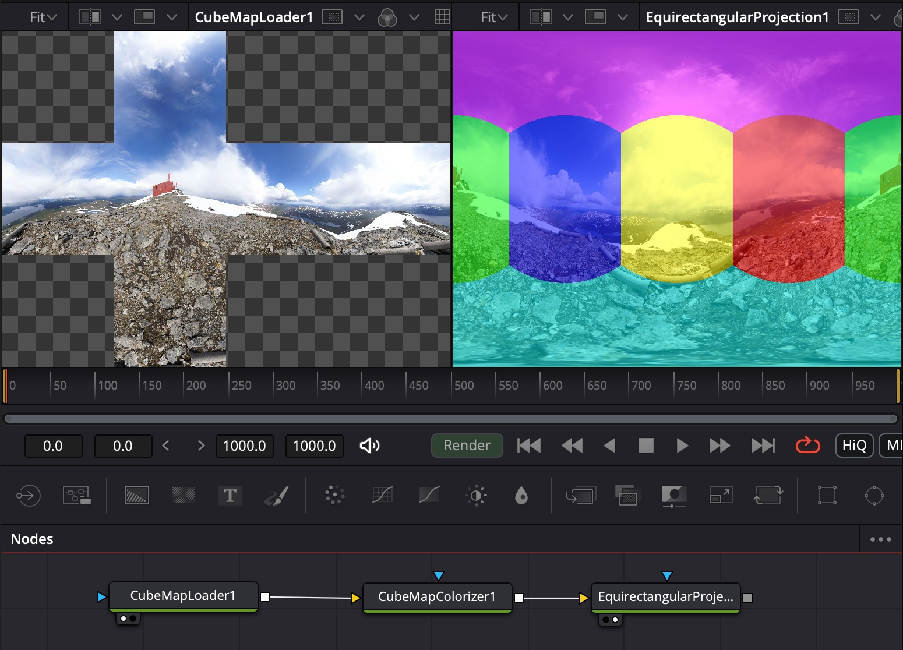

# Equirectangular Projection for CubeMaps

- [CubeMapEquirectangular.fuse](CubeMapEquirectangular.fuse)[^Madsy]  *... can be downloaded and copied manually into your fuses folder if needed*
- [CubeMapEquirectangular.comp](../Comp/CubeMapEquirectangular.comp)  *... needs the repository to be checked out as described in the [README](README.md)*

[^Ryfjallet]

What you can do with it:
- Connect a [CubeMapLoader](CubeMapLoader.md) to it ... and you see the cube's faces projected to a 2D image

[^Ryfjallet]: The picture you see being used as in input in the screenshot is the work of Emil Persson, aka [Humus](http://www.humus.name).
[^Madsy]: The DCTL code is based on the awesome work of Madsy who was so kind to release his implementation to the public domain
