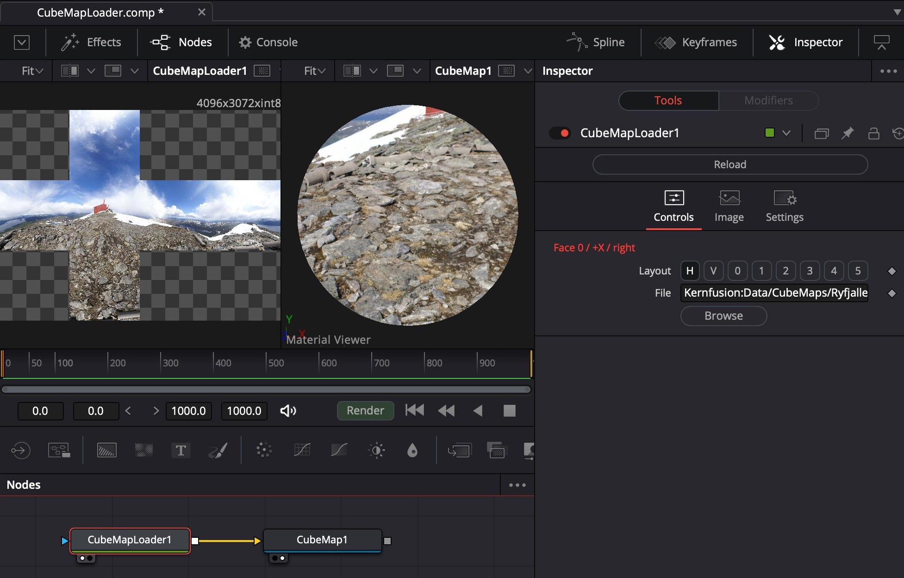

# CubeMap Loader

- [CubeMapLoader.fuse](CubeMapLoader.fuse)  *... can be downloaded and copied manually into your fuses folder if needed*
- [CubeMapLoader.comp](../Comp/CubeMapLoader.comp)  *... needs the repository to be checked out as described in the [README](README.md)*

Fuse to create a 2D representation of a cube map.

[^Ryfjallet]

[^Ryfjallet]: The picture you see being used as in input in the screenshot is the work of Emil Persson, aka [Humus](http://www.humus.name).

What you can do with it:
- Use it as an input for Fusion's *CubeMap (3Cu)* tool ... but I have no idea what this 3Cu tool is good for.
- Use it as an input for DCTL fragment shaders that work with a cube map texture (see [CubeMapUnfold](Studies/CubeMapUnfold.md)) ... but that's a very special use case.
- No idea if it is even needed - most probably there are already built-in tools that do all of this and a lot more?!?
- Or maybe it can be done with some images and transform nodes as a simple composition / macro / whatsoever?

Todo:
- Find out when and why `REG_Source_GlobalCtrls=false` shreds Fusion!?!

Things to discover in its source code:
- Simple but often forgotten things like setting tooltips on buttons and status texts
- Loading a sequence of pictures as a clip
- Creating a single image copying the clip pictures into a single texture
- Copy, translate, rotate images into a target texture (i.e. the vertical cross)
