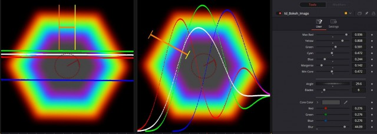

# Bokeh Image

> **Source:** *"\[DEV\] DCTL Convolve Bokeh Fuse"* [\#45](https://www.steakunderwater.com/wesuckless/viewtopic.php?p=36815#p36815) on WSL.

Macro to build up bokeh images. You can change the size of RGB/CMY areas individually to mimic symmetric chromatic aberration or other color effects. To receive a neutral color output without color tint it is helpful to use the LineScope fuse as well.

**Dependencies:** This macro requires the `KomkomDoorn.KD_ShapeRender`, `KomkomDoorn.KD_ShapeMerge`, and `KomkomDoorn.KD_ShapePrimitiveCreate` tools. Install ["Korokodove for Fusion/Resolve Studion 17"](https://gitlab.com/WeSuckLess/Reactor/-/blob/master/Atoms/com.KomkomDoorn.KrokodoveFu17/com.KomkomDoorn.KrokodoveFu17.atom) from the Reactor's "Tools/Plugins" section to make them available in your Fusion instance.

## Bokeh with Color Tint

*left image, LineScope with 4x zoom shows averaged G>R>B*

## Neutral Bokeh

*left image, LineScope with 4x zoom shows averaged R=G=B*

## Final

