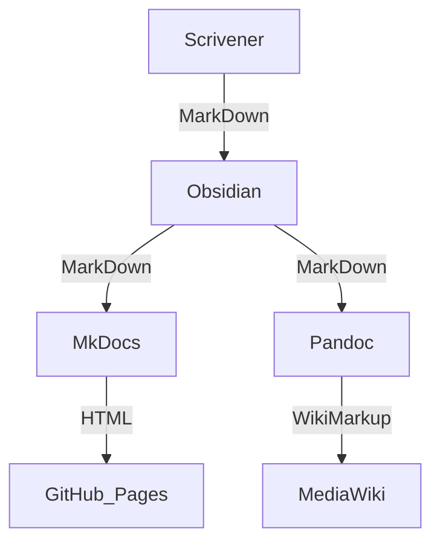

Scrivener's compile supports Multimarkdown and Pandoc output.
Obsidian uses Markdown.
MkDocs renders Markdown into a static HTML site.
Pandoc renders Markdown into MediaWiki.

Sounds simple and perfect to build a documentation workflow ...
... but turns out to be a rabbit hole that I'm not sure I want to jump into.





- Test: Internal link to an "index" file [[WebGL to DCTL]]
- Test: Internal link to a file [[Fuse-Settings]]


[[Kartaverse]]


## TODO: docconv

https://pkg.go.dev/code.sajari.com/docconv


## Scrivener

"Compile for: MultiMarkdown" and then "Duplicate & Edit Format..." the "Basic Pandoc".

Named the new format "Pandoc (nmbr73)" (or whatever you want).

Under 'Styles' add our 'Code Block (Lua)' style.

Check the 'Treat as raw markup' box.

Set 'Prefix/suffix:' to `\n```lua\n` and `\n```\n`. Enter the new line by pressing Opt + Enter in the input fields.

<!--
For non-code but still block styles fenced blocks (resulting in a 'Div') could make sense; here it would be:
`\n::: {custom-style="Code Block (Lua)"} :::\n` and `\n:::\n`
-->

> [!TODO]
> - https://iandol.github.io/scrivomatic/ , resp. https://github.com/iandol/scrivomatic
> - https://michalwyrwa.org/posts/2019-06-08-pandocscripts/

Document content in Scrivener is stored in RTF (Rich Text Format).
```sh
open Sources/Kernfusion.scriv/Files/Data/59587C22-40EF-4FD1-8674-595E763625CB/content.rtf
```

Pandoc comes already with a reader for RDF. To show the internal (native) pandoc representation (abstract syntax tree):
```sh
pandoc -s -t native 'Sources/Kernfusion.scriv/Files/Data/59587C22-40EF-4FD1-8674-595E763625CB/content.rtf'
```

Binder and styles are defined in XML. All the things are then tied together with UUIDs ... so if nothing else works, I could read that raw data.

> [!TODO]
> - http://lit-n-lat.blogspot.com/2010/02/coding-xml-formats-in-cocoa_05.html#links
> - https://blog.jayway.com/2020/01/23/attributed-strings-and-rich-text-files/

It would make total sense to apply more semantic markup in Scrivener. I managed to define 'Styles' (for example for "Code Block (Lua)", "Code Block (Python)") and to create my own 'Format' (for Multimarkdown and Pandoc) to apply the respective Markdown formatting. But this process is pretty tedious and very limited in the resulting markup we can achieve with it.

Internal links, 'Title' Style, and many more gets lost when exporting from Scrivener to (Pandoc) Markdown


## MkDocs

[MkDocs](https://www.mkdocs.org) generates static HTML sites out of Markdown sources and a single configuration YAML file.

MkDocs uses Python-Markdown, which is almost completely compliant with the original Markdown reference implementation. But MkDocs includes support for extending the Markdown syntax with [Python-Markdown extensions](https://python-markdown.github.io/extensions/).

> [!TODO]
> - Could be an option to creating other output formats from an MkDocs source using pandoc: [mkdocs-combine](https://twardoch.github.io/mkdocs-combine/)


Currently the image paths are sometimes broken!?!

- https://stackoverflow.com/questions/71074662/configuring-image-filepaths-correctly-in-mkdocs


## Pandoc

- Guter Artikel: https://ulriklyngs.com/post/2019/02/20/how-to-use-pandoc-filters-for-advanced-customisation-of-your-r-markdown-documents/
- Auch umfangreich: https://jmablog.com/post/pandoc-filters/

Pandoc uses by default its own [Pandocs Markdown](https://pandoc.org/MANUAL.html#pandocs-markdown) flavor.

Scrivener includes MultiMarkdown support.

> [!TODO] Check for interoperability options for Pandoc and Obsidian
> - [Obsidian & Pandoc](https://medium.com/@nicfab/obsidian-part-3-pandoc-87459fda89a5).
> - Maybe do my own [lua-filter](https://pandoc.org/lua-filters.html), and [custom-writer](https://pandoc.org/custom-writers.html) to read Obsidian Markdown and/or to create MkDocs markdown

Pandoc could in particular be the tool of choice to make convert the Obsidian Markdown files into WikiMarkup, MkDocs Narkdown, etc.


## Obsidian

Markdown: https://www.markdownguide.org/tools/obsidian/

> [!TODO]
> - https://obsidian-publisher.netlify.app
> - https://github.com/ObsidianPublisher/obsidian-mkdocs-publisher-template
> - https://github.com/ObsidianPublisher/obsidian-mkdocs-publisher-python
> - https://github.com/ObsidianPublisher/obsidian-github-publisher
> - https://github.com/jobindj/obsidian-publish-mkdocs
> - https://github.com/jobindjohn/obsidian-publish-mkdocs


> [!TODO] Create notes / descriptions / hierarchy for the folders in Obsidian:
> - https://github.com/xpgo/obsidian-folder-note-plugin
> - https://github.com/akosbalasko/zoottelkeeper-obsidian-plugin

Index files
- https://github.com/aidenlx/alx-folder-note
- https://forum.obsidian.md/t/folder-link-default-load-readme-md-file-just-like-github/41335


![[Scrivener_hierarchy01.png]]

-----

![[Scrivener_hierarchy02.png]]