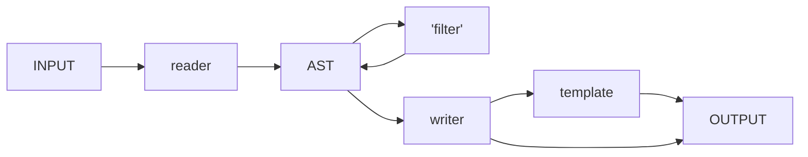

You'll find tons of excellent and thorough documentation on the different formats and tools ... and you can spent hours on each to find out what functionalities it provides. Intention of this section is not to rewrite the user manuals and enthusiasts' blog posts, but to hopefully give a good idea what you could use the different tools for and if they are worth a closer look - here with as much information as needed at as little text to read as possible.

## Pandoc

> [!summary]- Currently used to convert Scrivener exports
>  Not making much use of it - finding the first headline, finding all images, and (main part und really helpful) changing the formatting of image links. But Pandoc seems pretty versatile and powerful and could be of use for many other situations. And my usage so far shows a template, a filter and a writer.

Pandoc is a tool for transforming documents from one format to another, e.g. from Word to HTML. Install on macOS e.g. via `brew install pandoc`.

**Example:**
```sh
# Convert from Mardown to a Word document
pandoc document.md -o document.doc
```

It comes with 'readers' for the different input formats that parse the respective format into an abstract syntax tree (short: AST). The AST is pandoc's internal representation of a document's content. On the other end the 'writers' implement the conversion from the AST into the different output formats. Additionally there is the option to provide 'filters' that manipulate the AST after it has been read by a reader and before it gets processed by a writer. The writer's output can be further manipulated by 'templates' before it is written. The whole process is controlled by various command line parameters.



This simple concept allows for lots of conversions from many document formats into many others: If a format is not supported yet, you can implement a reader; if there is new format, just create a writer and you can convert all supported input formats into that format; a filter once cerated can be applied to all the input formats for all the output formats. And finally templates can be used for some rough building blocks, e.g. to embed your writers output in some header and footer.

- The list of supported **input/output formats** are listed under the `--from`/`--to` [General Options](https://pandoc.org/MANUAL.html#general-options).
- The **AST format** is described by the [Text-Pandoc-Definition](https://hackage.haskell.org/package/pandoc-types-1.22.2.1/docs/Text-Pandoc-Definition.html). You can use `--to=native` to get the internal Haskell representation of an input document.
- **Filtering** can be described in JSON or implemented in miscellaneous script languages (see: [filters](https://pandoc.org/filters.html)), but preferably Pandoc's integrated Lua interpreter can be used to realize [Pandoc Lua Filters](https://pandoc.org/lua-filters.html).
- **Templates** ...
	
...

Pandoc has for example a  [`--shift-heading-level-by`](https://pandoc.org/MANUAL#option--shift-heading-level-by) option which lets you increase or decrease the level of all headers in a document. 


## Markdown

Markdown is a simple, human readable text markup language. It allows for basic text formatting like headlines, sections, code block, links, bullet list, etc. to be done in a text editor. This makes it not only easy to learn, but also simple to parse and process.

**Example:**
```md
# A headline

Normal text with an *emphasized* word and
a [link](https://www.steakunderwater.com/).
```

There are various flavors of Markdown (e.g. [CommonMark](https://commonmark.org), or [GiHub Flavored Markdown](https://github.github.com/gfm/)) with different features out in the wild.

## MultiMarkDown

> [!warning]- Not used.
> Seemed at a first glance to be a good alternative to Pandoc's markdown flavour. But turned out to have no advantages.

[MultiMarkdown](https://fletcherpenney.net/multimarkdown/) is an extension (aka flavor) of Markdown adding support for features often needed for documentation purposes, such as math formulas, image attributes, definition lists, etc.

There is a [multimarkdown](https://fletcher.github.io/MultiMarkdown-6/) tool (`brew install multimarkdown`) that can be used to convert multimarkdown files into some other output formats (but probably pandoc is the better choice in this regard).

Scriviner includes MultiMarkdown support.

Pandoc allows for MultiMarkdown import and export by specifying the format being `markdown_mmd`.

Further reading:
- [Pandoc-vs-Multimarkdown](https://github.com/jgm/pandoc/wiki/Pandoc-vs-Multimarkdown)
- [Why I switched from MultiMarkdown to Pandoc](https://dtucker.co.uk/lifehack/why-i-switched-from-multimarkdown-to-pandoc.html)


## YAML front matter

YAML is a format for structured data. A YAML front matter is a section at the beginning of a (i.e. MarkDown) file used to provide additional information (meta data) in YAML format.

**Example:**
```md
---
aliases:
- Front Matter Demo
tags: [example, yaml]
---

Here comes the normal **MarkDown** document.
```

Obsidian allows the use of [YAML front matter](https://help.obsidian.md/Advanced+topics/YAML+front+matter) for tags and aliases. Scrivener does also output some minimal front matter like title, author, and such.
