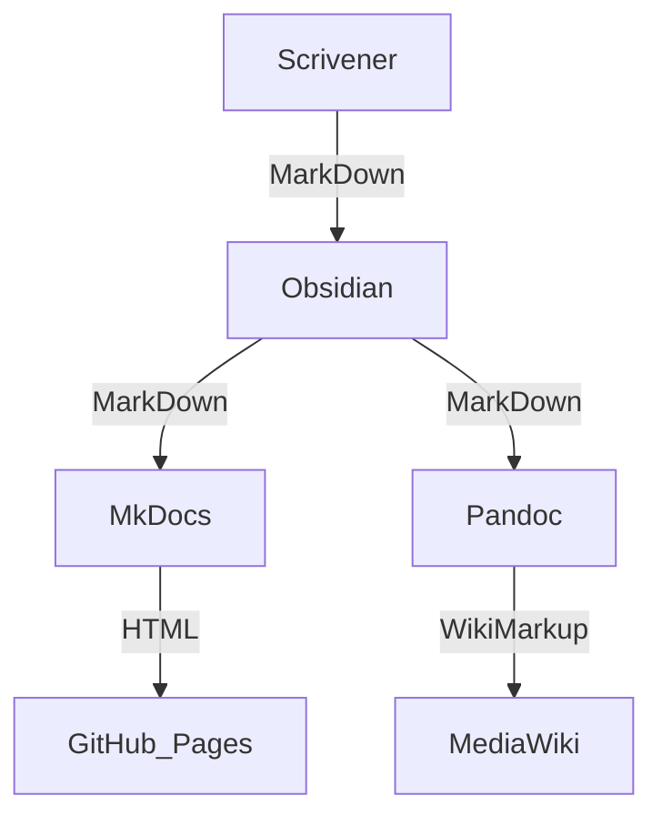

Everything VFx and such.

> [!hint] Status
> **Current status** is: Not much in here yet, but already a total mess.
> **Long term goal** is: To shred it all in favor of a better solution.

The following text is nonsense I guess - a good opportunity for someone who has a clue about the subject and can write in English: please go ahead and replace it!


# Motivation

Finding a "how to do this simple thing" all to often seems to be like searching the [VFXPedia](https://www.steakunderwater.com/VFXPedia/96.0.243.189/index4875.html?title=Main_Page) mirror, reading not only multiple articles the information is distributed across, but also the discussion pages, to then jump into some threads on the [wesuckless](https://www.steakunderwater.com/wesuckless/) and [bmd](https://forum.blackmagicdesign.com) forums to finally try a google search to maybe complement the whole picture by some (excellent but sometimes ancient) blog posts.

As done with VFxPedia, suggested by nmbr73, picked up by LearnNowFX, and supported by Andrew Hazelden: A MediaWiki is probably best suited to maintain such information and to make it some ever evolving and living documentation. We truly are a long way from that, but you have to start somewhere.


# Vision

Simply put, the idea is to build a *Wiki of ConFusion* to become *the next gen VFxPedia*; to revive the approach of building up a community driven knowledge base around VFx in general and the BMD tooling in particular. And yes, I know that this is impossible, totally ridiculous and absolutely insane, but ... I have no clue - I'm a beginner enough that I just don't care.

> [!quote]
>
> The day before something is a breakthrough, it’s a crazy idea.
> -- Peter Diamandis


# Approach

Most probably some 'critical mass' in terms of useful content is needed to attract people to use the information and to be willing to put own efforts in updating and complementing it.

Therefore the attempt is to first collect some existing documentation and rearrange it to be used as a foundation for a future Wiki.


# Tools

The [Kernfusion](https://github.com/nmbr73/Kernfusion) repository is here to compile, sort, structure and reformat content from different sources. Besides some tooling and experiments, the [Wiki/](https://github.com/nmbr73/Kernfusion/tree/main/Wiki) folder is the place where things mainly happen.

This folder is an [Obsidian](https://obsidian.md) vault, which - for the time being - seems to be well suited for the purpose: Obsidian is free and easy to use note taking app, and behind the scenes it is file based with all content in MarkDown format. MarkDown files, in turn, can be easily managed, read, converted and allow for collaborating and versioning via Git. Currently MkDocs is used to provide a *user friendly* output of the content on GitHub Pages. If - and only if - the repository's content evolves to something useful that's worth it to open up for editing by a broader community, it should be considered to abandon it - that is after exporting the repo's content some day as a basis for the to-be MediaWiki instance. But until then and unless this thing flies, a Git repo should perfectly do to get organized.


# Getting started

If you only want to use the documentation, then (for the time being) you can just access its latest version on [confusion.nmbr73.net](http://confusion.nmbr73.net/). But this documentation won't be all too useful unless there are people who volunteer to complement and update it. Find here what's needed to get involved ...

Tools you should have in your belt are at least Git, GitHub, and Obsidian for editing the documentation; you may want to install Python, VSCode, and maybe Lua if you are interested in working on the scripts.

> [!example]- Tool installation on macOS
>
> For macOS it's recommended to use [Homebrew](https://brew.sh) to manage the installation of third party tools.
> You may want to use one or the other of the following commands ...
>
> ```sh
> # install homebrew
> /bin/bash -c "$(curl -fsSL https://raw.githubusercontent.com/Homebrew/install/HEAD/install.sh)"
>
> # install git and github cli
> brew install git
> brew install gh
>
> # install obsidian and/or vscode editors
> brew install --cask obsidian
> brew install --cask visual-studio-code
>
> # install python and (maybe) lua for scripting
> brew install python@3.10
> brew install lua
> ```

First clone the Kernfusion repository by doing a `gh repo clone nmbr73/Kernfusion` (or alternatively by a  `git clone https://github.com/nmbr73/Kernfusion`).

Download Obsidian from [obsidian.md](https://obsidian.md) (or install via [`brew install --cask obsidian`](https://formulae.brew.sh/cask/obsidian#default) if you are on a Mac). Obsidian is used to edit files in the `Wiki/` subfolder. To do so just open this folder in Obsidian as a vault (select "Open folder as vault" and then chose the 'Kernfusion/Wiki/' subdirectory).

You should then see the exact documentation you are currently reading in Obsidian:

![[Screenshot of the Wiki as an Obsidian Vault.png]]

# Authoring

## Write with DaVinci Resolve / Fusion in mind

Topics of the articles should be all around visual effect tools in general and the BMD products in particular. It's worth to mention Blender, Houdini, After Effects, and whatever the market has to offer in this area - but they are well covered by other communities, and therefore focus here is on DaVinci Resolve and Fusion and how such tools integrate with these in a workflow for visual artists.

## Write with an audience in mind

Target audience of the articles is (maybe) ...

- users / vfx artists, using the different tools
- administrators / operators / engineers / pipeline TDs, provisioning and maintaining a vfx toolchain
- developers, writing tools, coding scripts, implementing drivers and programming visual effects

... with a focus on the latter two (in general very good and extensive manuals exist for the end-users of the tools) and blurred borders between the three.

Please organize / structure your articles with the different audiences in mind; complete articles dedicated to a specific audiences may be tagged as such ... maybe by `#artist`, `#admin`, `#automation`, `#scripting`, `#dev`, or the like? But I can't (and don't want to) set the rules how to do this: I think (hope) that it will just happen with some good examples that others copy and evolve.

## Write with a Wiki in mind

Depending on the source, we will have some material structured like a book - and people tend to build documentation this way. But whenever you ask yourself "how can I bring the files in the Obsidian folder into the right order", or "the order of the articles on the lefthand side of MkDocs output is not correct", you are probably on the wrong track! A Wiki is a "network" of articles and not designed to be read from a beginning to an end.

...

# Potential Sources

There's a lot of material we could start with and which is available. But ==it must be checked what of it may be used under which conditions.== Then each option need to be examined, if and how an initial import can be done - but most of it will probably need some scripting and lots manual effort.

- Andrew Hazelden has written nearly 2000 pages of documentation that he shared with the community
- Roger Magnusson's Fusion Class Browser could deliver lots of API definitions
- rne1223 has structured a lot of information for his [fuse-snippets](https://github.com/rne1223/fuse-snippets)
- [VFxPedia](https://www.steakunderwater.com/VFXPedia/96.0.243.189/index4875.html?title=Main_Page) contains a lot of (still valid) information that could serve as a basis
- There are many threads in the WSL forum that are written and structured in the format of an article or  documentation
- The BMD ASCII files in the developers examples could be a good start to extend and experiment

Feel free to extend this list with sources you know of.

# Next steps

Currenly just my personal to-do list:

- [x] Checkout the different export options of [Scrivener](https://www.literatureandlatte.com/scrivener/overview) (used by Andrew; `brew install --cask scrivener`)
- [ ] Allow for an easy local run of what currently the GitHub Action does; to allow everyone to test the scripts and the MkDocs output. Guess running a simple Docker container would be the best option for this.
- [ ] <del>Write a script to split a large .md file into single files on the basis of top-level headlines; this would allow to generate an index / toc file that lists each file in the correct order</del>
- [ ] Write a script to make the Obsidian files better suited for MkDocs: Convert file names in URL friendly names whilst maintaining the links in the MarkDown; Add the original filename as a top level heading in each file; rename the foldername.md to an index.md whilst maintaining the links; etc.
- [ ] Some time ago I played with the Fusion Class Browser to make it export some MarkDown files; have not yet got far with that solution, but still I believe its better to make the code create a clean export instead of cleaning it up afterwards; idk, however, first I have to find my old code on my hard disk
- [ ] Would be good to have some custom MarkDown extensions; i.e. having API descriptions integrated in a format that could be scanned for reuse it for intellisense and such would be great; trying to cleanly embed YouTube videos could be an experiment to start with ... first these must be implemented for Obsidian (see maybe [obsidian-simple-embeds](https://github.com/samwarnick/obsidian-simple-embeds) and in particular [obsidian-thumbnails](https://github.com/Meikul/obsidian-thumbnails) to play with it), and then maybe a MkDocs extension is needed to render it (or a quick and dirty script that patches the .md before it gets processed by MkDocs - not clean, but would work for other tools too).
- [ ] Should think about what I use and how to map it to a MediaWiki afterwards; e.g. folders could serve as categories and the index.md files as description of the respective category.


<!--
Okay, [MultiMarkdown](https://en.wikipedia.org/wiki/MultiMarkdown) still seems to be the best option. With and `.opml` (Titles only) I can restore the articles' order - format is simple and straight forward. Have to check what exacly happens


https://www.youtube.com/watch?v=yTMo9WkOphE
und hier ist was erklärt, das helfen könnte

https://www.youtube.com/watch?v=xisfLmWGXqA und vielleicht hier

https://medium.com/@TKalippke/all-you-have-to-do-is-type-yourself-494a2c0b2fd6

mit docker verbasteln - als beispiel
https://hub.docker.com/r/silentstorm/pandoc-mkdocs/

-->


# You should know

Scrivener's compile supports Multimarkdown and Pandoc output.
Obsidian uses Markdown.
MkDocs renders Markdown into a static HTML site.
Pandoc renders Markdown into MediaWiki.

Sounds simple and perfect to build a documentation workflow ...
... but turns out to be a rabbit hole that I'm not sure I want to jump into.





## Markdown

Is a simple, human readable text markup language. It allows for basic formatting like headlines, sections, code block, links, bullet list, etc. to be done in a text editor. This makes it not only easy to learn, but also easy to parse and process.

```md
# A headline

Normal text with an *emphasized* word and
a [link](https://www.steakunderwater.com/).
```

There are various flavors of Markdown (e.g. [CommonMark](https://commonmark.org), or [GiHub Flavored Markdown](https://github.github.com/gfm/)) with different features out in the wild.

## MultiMarkDown

[MultiMarkdown](https://fletcherpenney.net/multimarkdown/) is an extension (aka flavor) of Markdown adding support for features often needed for documentation purposes, such as math formulas, image attributes, definition lists, etc.

There is a [multimarkdown](https://fletcher.github.io/MultiMarkdown-6/) tool (`brew install multimarkdown`) that can be used to convert multimarkdown files into some other output formats (but probably pandoc is the better choice in this regard).

Scriviner includes MultiMarkdown support.

Pandoc allows for MultiMarkdown import and export by specifying the format being `markdown_mmd`.


## YAML front matter

YAML is a format for structured data. A YAML front matter is a section at the beginning of a (i.e. MarkDown) file used to provide additional information (meta data) in YAML format.

```md
---
aliases:
- Front Matter Demo
tags: [example, yaml]
---

Here comes the normal **MarkDown** document.
```

Obsidian allows the use of [YAML front matter](https://help.obsidian.md/Advanced+topics/YAML+front+matter) (Tags and Aliases should be very helpful). Scrivener has does output some front matter (but not of much use for us here).

## Pandoc

Pandoc is a tool to convert between various document formats. Install on macOS e.g. via `brew install pandoc`.

```sh
# Convert from Mardown to a Word document
pandoc document.md -o document.doc
```

Pandoc uses by default its own Markdown flavor called [Pandocs Markdown](https://pandoc.org/MANUAL.html#pandocs-markdown).

Scriviner includes MultiMarkdown support.

> [!TODO] Check for interoperability options for Pandoc and Obsidian
> - [Obsidian & Pandoc](https://medium.com/@nicfab/obsidian-part-3-pandoc-87459fda89a5).
> - Maybe do my own [lua-filter](https://pandoc.org/lua-filters.html), and [custom-writer](https://pandoc.org/custom-writers.html) to read Obsidian Markdown and/or to create MkDocs markdown

Pandoc could in particular be the tool of choice to make convert our Markdown files into WikiMarkup.

## MkDocs

[MkDocs](https://www.mkdocs.org) generates static HTML sites out of Markdown sources and a single configuration YAML file.

MkDocs uses Python-Markdown, which is almost completely compliant with the original Markdown reference implementation. But MkDocs includes support for extending the Markdown syntax with [Python-Markdown extensions](https://python-markdown.github.io/extensions/).

> [!TODO]
> - Could be an option to creating other output formats from an MkDocs source using pandoc: [mkdocs-combine](https://twardoch.github.io/mkdocs-combine/)


## Scrivener

> [!TODO]
> - https://iandol.github.io/scrivomatic/ , resp. https://github.com/iandol/scrivomatic
> - https://michalwyrwa.org/posts/2019-06-08-pandocscripts/

Scrivener organizes all its text files in RTF. Binder and styles are defined in XML. All the things are then tied together with UUIDs ... so if nothing else works, I could read that raw data.

> [!TODO]
> - http://lit-n-lat.blogspot.com/2010/02/coding-xml-formats-in-cocoa_05.html#links
> - https://blog.jayway.com/2020/01/23/attributed-strings-and-rich-text-files/

It would make total sense to apply more semantic markup in Scrivener. I managed to define 'Styles' (for example for "Code Block (Lua)", "Code Block (Python)") and to create my own 'Format' (for Multimarkdown and Pandoc) to apply the respective Markdown formatting. But this process is pretty tedious and very limited in the resulting markup we can achieve with it.


## Obsidian

Markdown: https://www.markdownguide.org/tools/obsidian/

> [!TODO]
> - https://obsidian-publisher.netlify.app
> - https://github.com/ObsidianPublisher/obsidian-mkdocs-publisher-template
> - https://github.com/ObsidianPublisher/obsidian-mkdocs-publisher-python
> - https://github.com/ObsidianPublisher/obsidian-github-publisher
> - https://github.com/jobindj/obsidian-publish-mkdocs
> - https://github.com/jobindjohn/obsidian-publish-mkdocs


> [!TODO] Create notes / descriptions / hierarchy for the folders in Obsidian:
> - https://github.com/xpgo/obsidian-folder-note-plugin
> - https://github.com/akosbalasko/zoottelkeeper-obsidian-plugin


<!--

# Welcome to the Kernfusion (yet not a) Wiki!

Yet nothing usable to be found here ... still nothing more than my personal notebook / scribbling pad. ...

* [[Event-Functions]]
* [[AddControlPage]]
* [[MultiButtonControl]]
* [[WebGL to DCTL|WebGL to DCTL]]

-->

